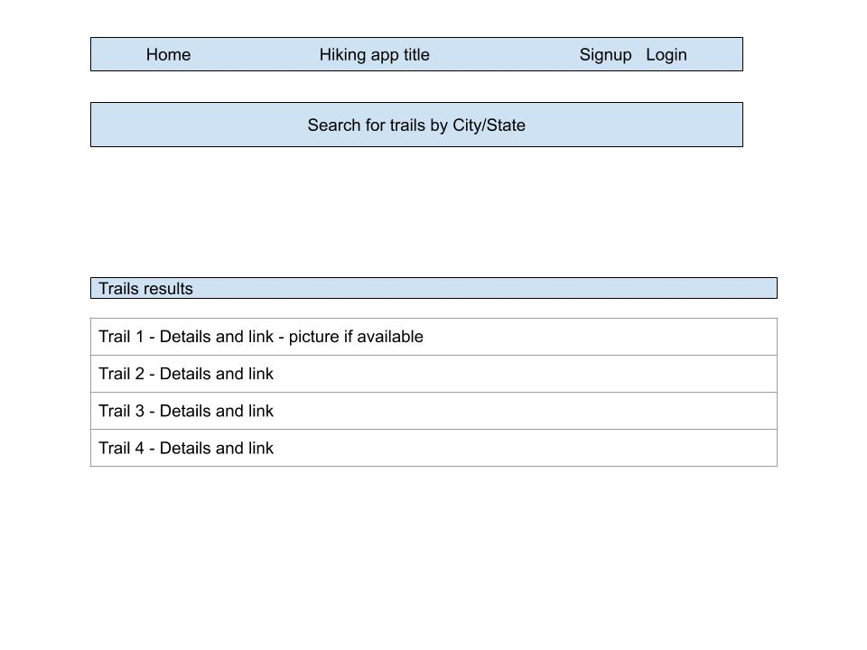

# Hiking Trail application URL
https://hiking-trails-app-project-3.herokuapp.com/

# Technologies for this Build
React
React Router
Axios,
Node.js,
MongoDB,
Express,
CSS

# Data Models
User schema,
Favorites schema - to save user's favorite trails in App

# API's used in project
API: https://developer.mapquest.com/documentation/ - used to get longitude/latitude coordinates based on town/state
API: https://www.hikingproject.com/data - used to locate trails in your area based on longitude/latitude
 

# Additional features that I would like to add at a later date:
The ability to call the trails API based on favorites list so that current trail data can be provided.

# Lessons Learned

# Approach:
Originally set out to build an application where a user could look for hiking trails in their local area
and see possible ratings, pictures and level of difficulty.  
Once the team set out we thought it would be nice to have an index card displayed for each trail with a picture and some 
high level information.  Upon reviewing a card, if interested, a user could then select a link on a particular card to see additional detail informaiton on the trail.  In addition, you would be provided a google map for the location of the trail that provides the ability to view the trail.

Additional features are being added to have users select and save favorite trails that can later be retrieved as a list of favorites.

# User stories for Project 3 - Hiking Trail App
As a user I want to be able to search for trails so that I can see trails based on location.
As a user I want to be able to see the ratings of each trail.
As a user I want to be able to see pictures of each trail.
As a user I want to be able to search trails in my town or lat/long.
As a user I want to be able to see trails based on length of trail  so that I can decide if it suits me.
As a user I want to be able to see trails based on level of difficulty so that I can decide if I want to hike it.
As a user I want to be able to see trail condition details.
As a user I want to be able to see the date of trail condition reported.
As a user I want to be able to see the summary or description of the trail.
As a user I want the ability to click on a trail if I want to see the details.
As a user I want to be able to favorite trails that I want to hike.

# Wire Frame Diagram
